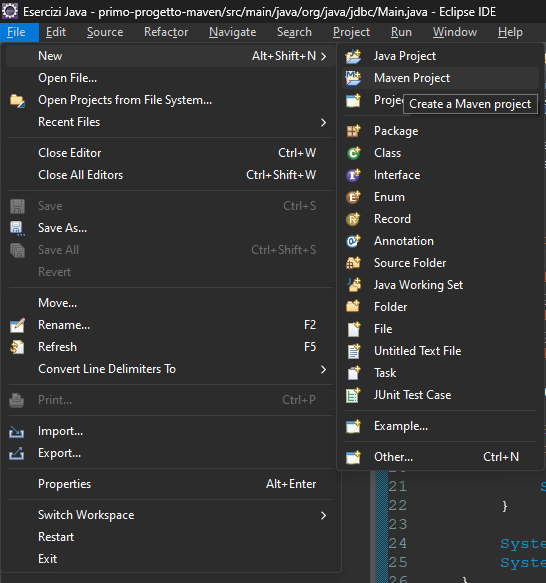
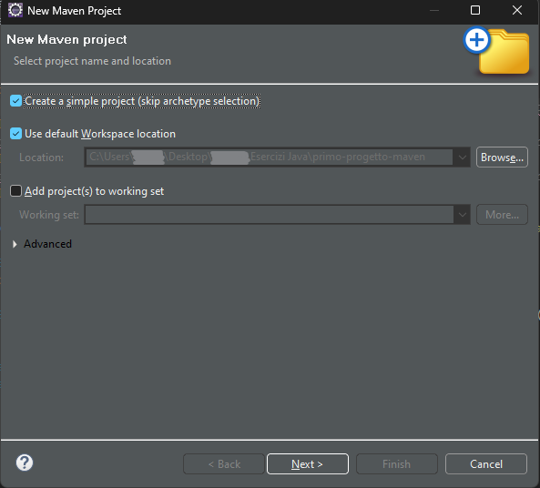
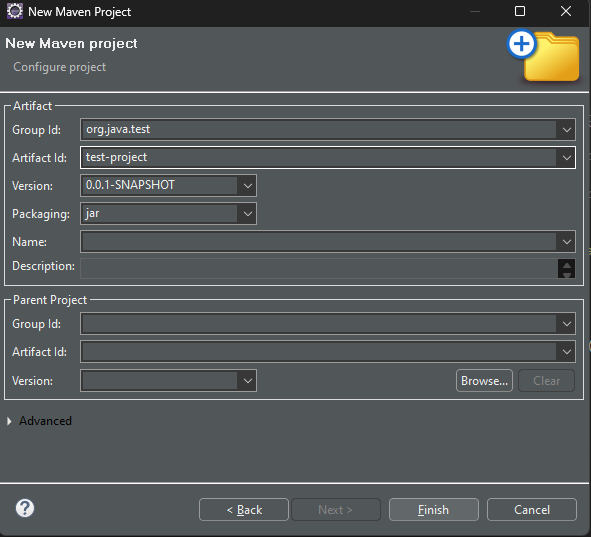

# TEMPLATE DI UN PROGETTO MAVEN COLLEGATO AD UN DB

## PASSAGGIO 1
### CREARE IN ECLIPSE UN NUOVO PROGETTO MAVEN


## PASSAGGIO 2


## PASSAGGIO 3


## PASSAGGIO 4
### MODIFICARE IL FILE POM INSERENDO

```
<project xmlns="http://maven.apache.org/POM/4.0.0" xmlns:xsi="http://www.w3.org/2001/XMLSchema-instance" xsi:schemaLocation="http://maven.apache.org/POM/4.0.0 https://maven.apache.org/xsd/maven-4.0.0.xsd">
  <modelVersion>4.0.0</modelVersion>
  <groupId>org.java.jdbc</groupId>
  <artifactId>primo-progetto-maven</artifactId>
  <version>0.0.1-SNAPSHOT</version>
  
<!-- https://mvnrepository.com/artifact/mysql/mysql-connector-java -->
<!-- questo è il sito in cui ci sono tutte le versioni e da dove si scarica il JDBC cioè MySQL Connector -->
<!-- https://mvnrepository.com/artifact/mysql/mysql-connector-java/8.0.33 -->
<!-- questa è la versione scaricata -->
  <dependencies>
    <dependency>
      <groupId>mysql</groupId>
      <artifactId>mysql-connector-java</artifactId>
      <version>8.0.33</version>
    </dependency>
  </dependencies>
  
</project> -->
```

## PASSAGGIO 5
### CREARE LA CLASSE MAIN E INSERIRE

```
package org.java.jdbc;

import java.sql.Connection;
import java.sql.DriverManager;

public class Main {

	public static void main(String[] args) {
																 // sostituire 3306/nome_db con la porta da collegare e con il nome del database
		final String url = "jdbc:mysql://localhost:3306/db_aeroporto";
		// sostituire 'root' con il nome inserito in mamp o PHP Launcher
		final String user = "root";
		// sostituire '' con la password inserita in mamp o PHP Launcher
		final String password = "";
		
		try (Connection conn = DriverManager.getConnection(url, user, password)) {
			
			System.out.println("Connessione stabilita correttamente");
		} catch (Exception e) {
			
			System.out.println("Errore di connessione: " + e.getMessage());
		}
		
		System.out.println("\n----------------------------------\n");
		System.out.println("The end");
	}
}
```
